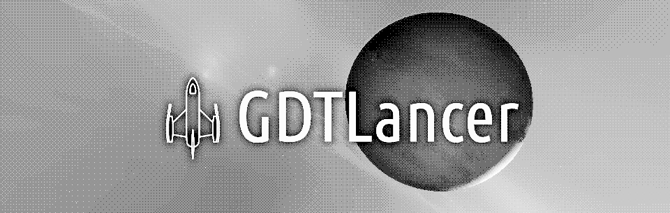

# GDTLancer Game Design Documentation

This repository contains the Game Design Documentation (GDD) for **GDTLancer: Generative Dynamic Transmedia Lancer**.

GDTLancer is envisioned as a multi-platform space adventure RPG blending sandbox simulation with TTRPG-inspired emergent narrative mechanics. It aims to create a living world shaped by the actions of both the player and AI agents, with a distinct neo-retro visual style and a focus on player agency in choosing their approach to risk and narrative engagement.

The main repository for the game project itself can be found at:
[https://github.com/roalyr/GDTLancer](https://github.com/roalyr/GDTLancer)

---

## Documentation Pages

This documentation is organized into several key areas:

### 0. Core Vision & Introduction

* [**0.1-GDD-Main.md**](./0.1-GDD-Main.md): The central Game Design Document outlining the overall vision, game pillars, development framework (Layers, Modules, Systems), phased plan, and summaries of core concepts. (Reviewed: v1.7.1, 2025-06-22)
* [**0.2-GDD-Mottos-Sayings.md**](./0.2-GDD-Mottos-Sayings.md): Lists key mottos for the game's branding and ethos, alongside in-game lore-wise sayings. (New: v1.1, 2025-05-16)

### 1. Core Systems & Mechanics

* [**1-GDD-Core-Mechanics.md**](./1-GDD-Core-Mechanics.md): Details the fundamental, universal mechanics: the **Action Check** (3d6+Mod resolution), **Focus Points (FP)** meta-resource, and the **Action Approach** system (`Act Risky`/`Act Cautiously`). (Reviewed: v1.3, 2025-05-16)

### 2. Development Challenges

* [**2-GDD-Development-Challenges.md**](./2-GDD-Development-Challenges.md): Identifies and acknowledges the primary challenges and inherent risks associated with the development of GDTLancer. (Reviewed: v1.1, 2025-05-16)

### 3. Development Architecture

* [**3-GDD-Coding-Architecture.md**](./3-GDD-Coding-Architecture.md): Outlines the coding style conventions, architectural patterns (Autoloads, Components, Resources, Scene Structure), and development philosophy for the Godot implementation. (Reviewed: v1.3, 2025-06-22)
* [**3.1-GDD-Ship-Design-Philosophy.md**](./3.1-GDD-Ship-Design-Philosophy.md): Defines the core design principles for ships, including the "Lancer" paradigm of melee-centric combat. (New: v1.0, 2025-06-22)

### 4. Analogue Version

* [**4.1-GDD-Analogue-Setup.md**](./4.1-GDD-Analogue-Setup.md): Describes the recommended physical components and general organization for playing the tabletop RPG version. (Reviewed: v1.2, 2025-05-16)
* [**4.2-GDD-Analogue-Setup-Formatting.md**](./4.2-GDD-Analogue-Setup-Formatting.md): Specifies the detailed layout, content areas, and formatting for the physical sheets used in the analogue version. (Reviewed: v1.1, 2025-05-16)
* *(Placeholder for Analogue-specific rules variants or system documents)*

### 5. Gameplay Modules

* [**5.1-GDD-Module-Piloting.md**](./5.1-GDD-Module-Piloting.md): Specific design details for the Piloting & Travel gameplay module, covering manual flight integration and abstracted travel mechanics (`Undertake Journey`, `Fast Transit`). (Reviewed: v1.5, 2025-06-22)
* [**5.2-GDD-Module-Combat.md**](./5.2-GDD-Module-Combat.md): Details the mechanics for ship-to-ship conflict, dual-purpose assets, and the "Lancer" combat doctrine. (New: v1.0, 2025-06-22)
* *(Placeholder for future module design documents, e.g., Trading, etc.)*

### 6. Lore & Player Experience

* [**6.1-GDD-Lore-Background.md**](./6.1-GDD-Lore-Background.md): Outlines the foundational lore, history of humanity's journey, "The Pillar," the "Opulence" system, and core cultural/physiological traits. (Reviewed: v1.4, 2025-05-16)
* [**6.2-GDD-Player-Onboarding.md**](./6.2-GDD-Player-Onboarding.md): Details the strategy for player onboarding, addressing information density and the gradual introduction of game mechanics. (New: v1.0, 2025-05-16)

### Meta & Legal

* [**LICENSE**](./LICENSE): Contains the licensing information for this documentation project.
* [**AI-ACKNOWLEDGEMENT.md**](./AI-ACKNOWLEDGEMENT.md): Details regarding the use of AI assistance during the generation and refinement of this documentation.
* [**AI-PRIMING.md**](./AI-PRIMING.md): Defines the standard priming prompt to be used when initiating a new chat session with an AI assistant.

## All pages in a single file

* [**GDD-COMBINED-TEXT.md**](./GDD-COMBINED-TEXT.md): If you need all pages in a single file.

---

This documentation is a living project and currently under active development.

---

## Draft README for Main Game Repository (`roalyr/GDTLancer`)

*(This section contains the planned README content for the main game implementation repository. It will be moved there once the relevant branch is updated.)*

# GDTLancer: Generative Dynamic Transmedia Lancer

**GDTLancer** is a multi-platform space adventure RPG combining sandbox simulation with TTRPG-inspired emergent narrative mechanics. Explore a living, dynamic universe where your actions, and those of AI agents, shape the course of history.

This project aims to create a unique experience blending the freedom of classic space sims with the deep, player-driven stories found in tabletop roleplaying games, all presented in a distinct neo-retro 3D visual style.

**Current Status:** Undergoing refactoring.

### Core Concepts & Features (Based on Design):

* **Living Universe:** A persistent world simulated dynamically, where NPC agents pursue their own goals using the same core mechanics as the player, influencing factions, economies, and discoveries.
* **Emergent Narrative:** Stories evolve organically from the interplay of game systems, agent actions, and generated events, rather than following rigid plots.
* **Hybrid Gameplay:** Engage in direct simulation gameplay (piloting, combat, trading) within distinct **Gameplay Modules**. High-stakes actions are resolved via an **Action Check** (3d6+Modifier), influenced by **Focus Points (FP)**.
* **Player Agency:** Choose your level of engagement – focus on simulation modules or narrative systems. Manage risk by declaring an **Action Approach** (`Act Risky` or `Act Cautiously`) for key actions, influencing potential outcomes. Set long-term goals via the Goal System.
* **Transmedia Vision:** Planned versions include:
    * Primary PC/Mobile build (Godot Engine 3).
    * Simplified J2ME version (turn-based, wireframe).
    * Analogue Tabletop RPG ruleset.
* **Neo-Retro Aesthetics:** Distinctive visual style using minimalist 3D, hard edges, solid colors, and stylized lighting.
* **Chronicle System:** Uncover the generated history of the world through an in-game interface logging significant player and NPC actions.

### Design Documentation

The detailed design principles, mechanics, and development plan for GDTLancer reside in its dedicated documentation repository:
**[GDTLancer Game Design Documentation](
